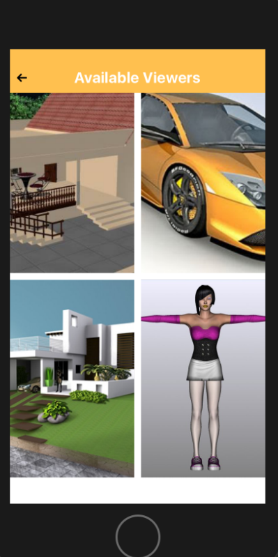
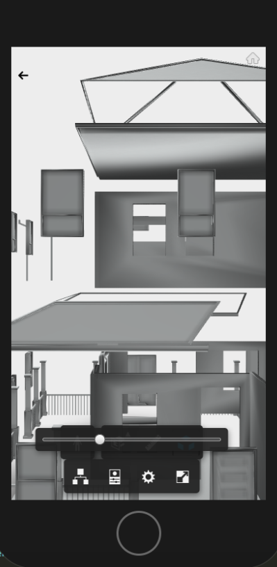
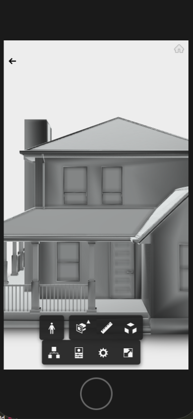
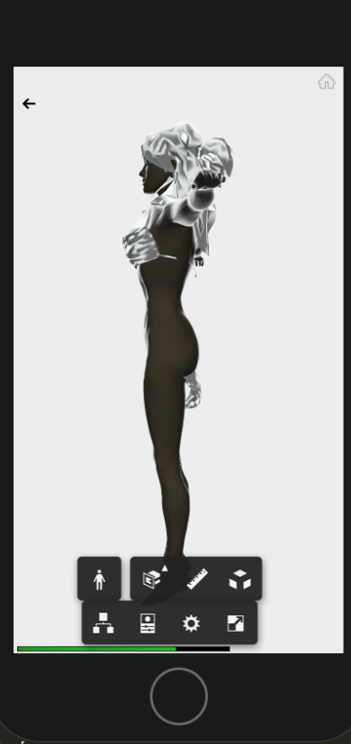

This app is created by using react native which supports
iOS and Andriod. I embedded 3D viewer in the app by using
Autodesk api's.

How to create account and how to create personal app is explained in detail
on Autodesk website:

https://developer.autodesk.com/api/view-and-data-api/

This app is running on my credentials. Please replace with your credentials for testing.

## How to Build and run the app:

1 npm install

2 react-native run-ios

3 react-native run-andriod

## Result

       .png)  

